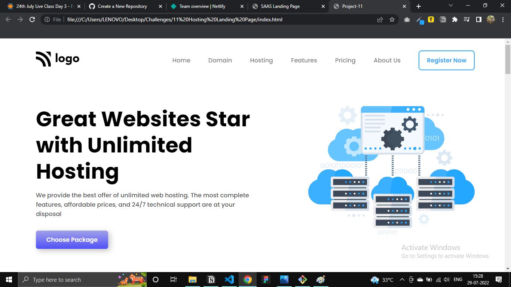
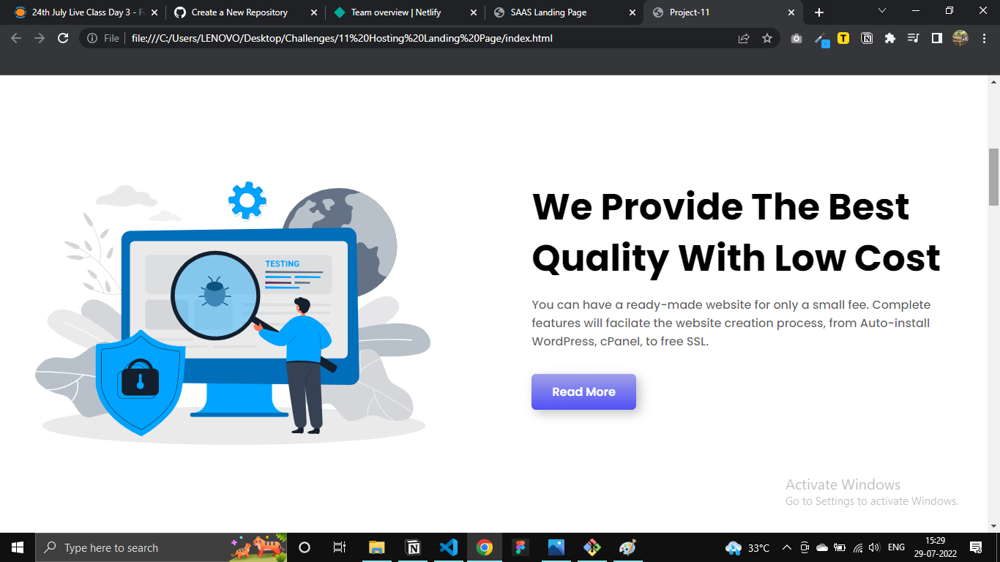
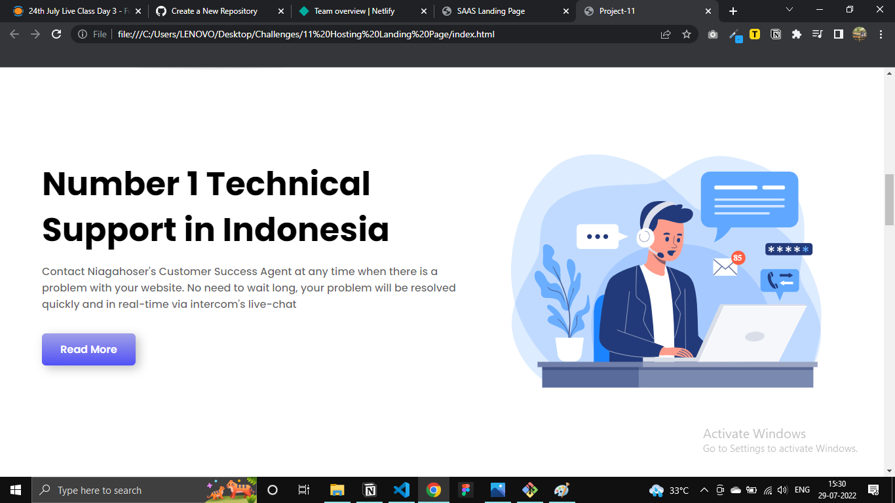
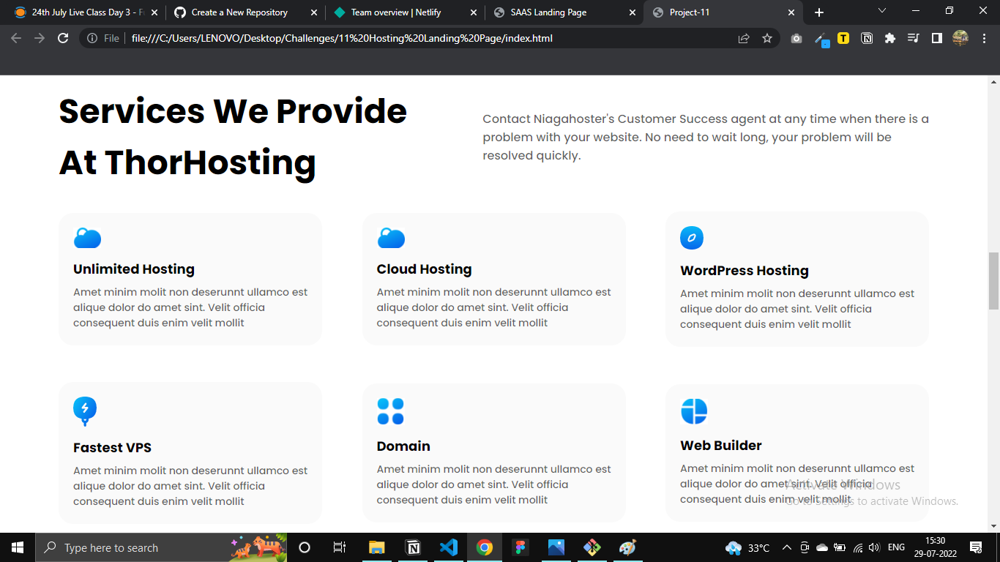
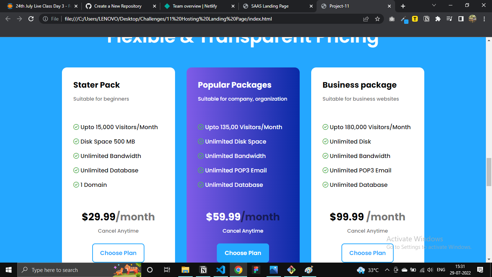
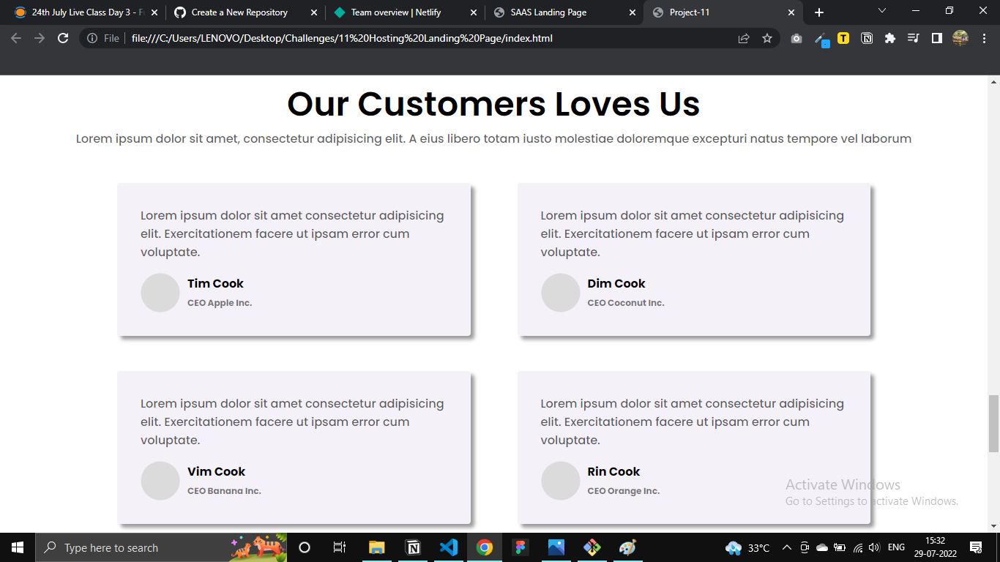
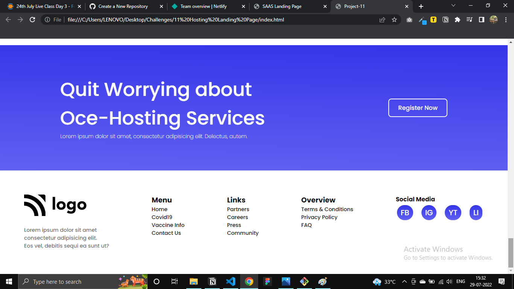

## HOSTING LANDING PAGE

Of all the 15 Assignment projecs this is the one project I spent a lot of time with, Leran a lot, and had a lot of Satisfaction after the result

>THIS IS NOT RESPONSIVE AT PRESENT -- 
 PLEASE OPEN IN A DESKTOP

### Things I learnt while building:
- Planning the HTML structure
- Using Flexbox may not be efficiently but very effectively
- To deal with positions
- Applying `Linear-gradient` to buttons
- To make cards and dealing with elements inside them.

### Time Taken:
Approx 11 hours

#### Here is the link of live website: [Live Website]().

#### Here are some screenshots of how webpage looks.

Thanks for visiting.

Please share your feedback and help me in my learning process.[Twitter](https://twitter.com/VivekNakkana)